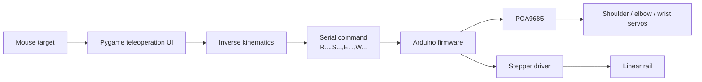

# Linear-Rail PRRR Robotic Arm


> A mouse-controlled teleoperation system for a rail-mounted planar robotic arm, combining real-time inverse kinematics, a Pygame control interface, and Arduino-based motor control.


## Overview

This project implements a **PRRR-style robotic manipulator**: a motorized linear rail carries a two-link arm, with servo-driven shoulder, elbow, and wrist joints. Moving the cursor in the Python application selects an end-effector target; the inverse-kinematics solver converts that target into rail and joint commands, which can be sent over serial to the Arduino controller.

The repository includes the control software, embedded firmware, project photos, and folders reserved for CAD and computer-vision work.

## Highlights

- Real-time mouse-based end-effector control
- Planar inverse kinematics with reachability handling
- Smoothed target motion and an on-screen end-effector trail
- Visual simulator built with Pygame
- Serial command format for live hardware control
- PCA9685 servo control with calibrated joint offsets
- AccelStepper-based, non-blocking linear-rail motion
- Arm-first sequencing: the rail moves after the arm is within its target tolerance

## System Architecture



## Hardware at a Glance

| Subsystem | Implementation in this repository |
| --- | --- |
| Linear axis | Stepper motor via CNC Shield Z-axis pins (`STEP 4`, `DIR 7`) |
| Rail travel | `0–300 mm` (`0–30 cm` in the Python UI) |
| Rail drive | GT2 20-tooth pulley, 1/8 microstepping; configured as `150 steps/mm` |
| Arm | Two planar links: `L1 = 20 cm`, `L2 = 10 cm` |
| Joints | Shoulder, elbow, and wrist servos through a PCA9685 at I²C `0x40` |
| Servo channels | Shoulder `0`, elbow `2`, wrist `3` |

> **Safety first:** Test with the arm elevated, the rail clear, and conservative speed settings. Verify servo direction, mechanical limits, offsets, and the rail zero position before enabling live serial control.

## Repository Layout

```text
.
├── IK/
│   ├── teleop.py       # Pygame teleoperation interface and simulator
│   └── iksolver.py     # RPR inverse-kinematics solver
├── FIRMWARE/
│   └── ard.ino         # Arduino + PCA9685 + AccelStepper controller
├── CAD/                # CAD assets / documentation placeholder
├── COMPUTER VISION/    # Computer-vision assets / documentation placeholder
├── IMAGES/             # Build and hardware photographs
└── Software Images/    # Teleoperation UI screenshots
```

## Software Setup

### Requirements

- Python 3.9 or newer
- [Pygame](https://www.pygame.org/)
- [pySerial](https://pyserial.readthedocs.io/)
- Arduino IDE
- Arduino libraries: `Adafruit PWM Servo Driver Library` and `AccelStepper`

Install the Python packages:

```bash
python -m pip install pygame pyserial
```

### Run the simulator

From the repository root, start the teleoperation UI:

```bash
python IK/teleop.py
```

Move the mouse inside the blue workspace to command the simulated end effector. The panel displays the calculated rail height and joint angles.

> **Note:** `teleop.py` currently imports `RPR` as `from IK import RPR`, while the solver is stored in `IK/iksolver.py`. If Python raises an import error, update that import to `from iksolver import RPR` when running from the `IK` folder, or package the `IK` directory and import `RPR` from `IK.iksolver`.

## Firmware Setup

1. Install the two Arduino libraries listed above.
2. Open [`FIRMWARE/ard.ino`](FIRMWARE/ard.ino) in the Arduino IDE.
3. Select the correct board and port, then upload the sketch.
4. With power removed from actuators, verify PCA9685 wiring, rail driver wiring, and servo channel assignments.
5. Power the actuators from a suitable external supply, sharing a common ground with the controller.
6. Calibrate `SHOULDER_OFFSET`, `WRIST_OFFSET`, `stepsPerMM`, and rail limits for the assembled mechanism.

The firmware initializes all joints near 90° and prints `READY` on the serial port once configured.

## Live Teleoperation

Live serial control is intentionally disabled in `IK/teleop.py` by default. Once the simulator behaves correctly and the hardware has been calibrated:

1. Set the correct serial port in `teleop.py` (the example uses `COM5`).
2. Uncomment the `serial.Serial(...)`, `arduino.write(...)`, and `arduino.close()` lines.
3. Use the same baud rate on both ends. The Arduino sketch uses **9600 baud**; the commented Python example currently uses **115200 baud**.
4. Keep the robot clear of obstacles and test a small area of the workspace first.

### Serial Protocol

Commands are newline-terminated CSV records:

```text
R<rail_mm>,S<shoulder_deg>,E<elbow_deg>,W<wrist_deg>
```

Example:

```text
R150,S90,E130,W40
```

The Python interface emits rail position in centimetres, whereas the firmware constrains `R` to millimetres (`0–300`). Align the units in the sender and receiver before operating the physical rail.

## Control and Kinematics

The UI restricts the target to a rectangular workspace from `x = 12–30 cm` and `y = 0–30 cm`. The solver uses the two-link planar relation

```text
D = (x² + y² − L1² − L2²) / (2L1L2)
```

to select a reachable elbow configuration, then derives shoulder and elbow angles. The wrist orientation is maintained with:

```text
wrist = 270° − elbow − shoulder
```

Motion is rate-limited in the UI and smoothed again in firmware. The rail command is applied only after the three arm joints are close to their targets.

## Gallery

| Hardware | Teleoperation interface |
| --- | --- |
|  |  |

More project photographs are available in [IMAGES](IMAGES), and interface captures are in [Software Images](Software%20Images).

## Known Integration Checks

Before a live run, review these repository settings together:

- Python import path for `RPR` (`IK/teleop.py` ↔ `IK/iksolver.py`)
- Python and Arduino serial baud rate
- Rail command units (Python centimetres vs. firmware millimetres)
- Serial port name, servo offsets, directions, and rail zero reference

## License

This project is released under the [MIT License](LICENSE).
